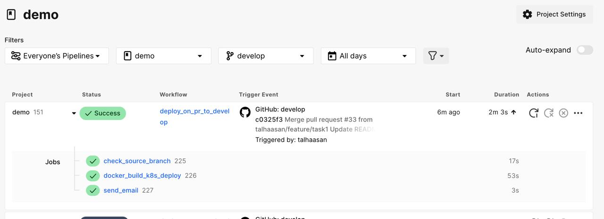

# Atolye15 Demo

Bu ekrana sadece Hello world yazdiran basit bir Nest.JS uygulamasi. Senden asagidaki sekilde bir pipeline olusturmani bekliyoruz;

Git repomuzda `master` ve `develop` branch'leri bulunuyor. Insanlar `develop` branch'ine feature branch'ler uzerinden yeni ozellikler ekleyebilirler. Bunun icin de soyle bir pipeline planliyoruz;

Kisi gerekli commit'leri attiktan sonra CI (Biz genelde CircleCI kullaniyoruz ama sen istedigini kullanabilirsin) aracinda sirasiyla asagidaki kontroller calisir;

- Lint kurallari geciyor mu: `yarn lint`
- Formatlama kurallarina uyuyor mu: `yarn format:check`
- Unit testler geciyor mu: `yarn test`
- Coverage threshold'una uyulmus mu?: `yarn test:cov`
- E2E testler geciyor mu: `yarn test:e2e`

Tum bu kontroller pass olduktan sonra PR `develop` ile birlestigi zaman senin yazmis oldugun bu projeye dahil edecegin `Dockerfile`'daki stepleri takip eden herhangi bir builder'da image build alip onu herhangi bir private container registy'e yollamani bekliyoruz. GCloud'ta oldugunu varsayarsak bu araclar cloud build ve GCR olacaktir. Sen istedigin cozumu kullanabilirsin.

Image registry'e gittikten sonra latest tag'li bu image'in Kubernetes tarafinda senin yazdigin manifestolara uygun olarak `stage` namespace'inde yayina girmesini istiyoruz. Bu asamada ilgili kisiye mail gidebilir. Daha sonra Git tarafinda `develop`'tan `master`'a PR acildiginda tum surec tekrar yukaridaki gibi isleyip en sonunda `production` namespace'inde Kubernetes uzerinde yayinda olmasini bekliyoruz.

Kubernetes tarafinda da Let's encrypt uzerinden auto provision ile SSL ayarlarsan da super olur.

Pipeline'in istedigin kismini es gecebilir veya kendince daha dogru oldugunu dusundugun bir hale getirebilirsin.

NOT: Dependency'lerin kurulmasi icin proje dizininde `yarn` komutunun calistirilmasi gerekiyor.

NOT: Uygulama `yarn start:prod` komutu ile ayaga 3000 portunda ayaga kalkiyor.

# Sonuç

Eksikler:
Proje lint adımında hata veriyor, hata kod tarafında biraz baktım ama çözümü bulamadım.
Pipeline'da bu kısmı yoruma aldım.

Yapılabilecekler:
Image tag'i commit id kullanılarak hata oluşması durumunda debug ve rollback işlemleri kolaylaştırılabilr.

Yapılanlar:
Pipeline yapıları stage(.circleci/config.yaml) ve prod(.circleci/configprod.yaml) CircleCI'da kurulmuştur.

Google Cloud'da Kubernetes cluster'ı kurulmuştur.

Cluster'a ingress ve cert-manager uygulamaları kurulmuştur.

Google Cloud domain'den talhaasan-atolye15hello.com satın alınarak letsencrypt üzerinden SSL ayarları yapılmıştır.

Oluşturulan manifest dosyaları ortamlara göre pipeline'da uygulanmıştır.

k8s/ssl/letsencrypted-issuer.yaml-> cert manager letsencrypt'e sertifika oluşturma doğrulayıcısını aktifleştiriyor.

k8s/ssl/certrequest.yaml->letsenycrytedissuer kullanarak secretlara stage namespace'inde talhaasan-atolye15hello.com'a göre 
otomatik sertifika genarete ediyor.

k8s/ssl/ingress.yaml-> Üretilen secret ve domain veriliyor.

Deployment sonunda da her iki ortam için de mail gönderilmektedir.(Projeyi sizinle paylaşmak için public'e dönüştürdüğümde SendGrid api key'leri sildi.)

Pipeline yapısı:

Süreç demo ve prod olmak üzere 2 pipeline oluşturularak tasarlanmıştır.
demo pipeline'ı(güncel hali develop branch'inde config.yml dosyası) stage ortamına deployment yaparken
prod pipeline'ı(üncel hali master branch'inde configprod.yml dosyası) producton'a deployment yapıyor.

Akış:

Developer feature* branch'ine commit atıyor ve test adımları çalışıyor.

Test adımları başarılı olursa develop branchine PR açıyor,
bu PR onaylandığında ise stage ortamı için build,deploy ve mail gönderme işini yapıyor.

Bu adım da başarılı olursa, deploy branch'inden master branch'ine PR geldiğinde ve onaylandığında
production deploy ve mail gönderme işini yapıyor.

Son

